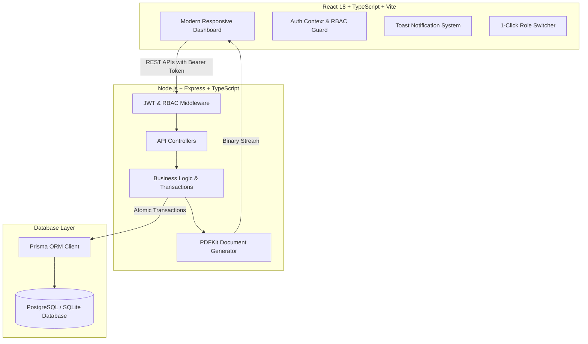

# NexFlow | Mini ERP + CRM Operations Portal

> **Full Stack Developer Case Study**: Production-grade Operations Portal built with **Node.js, TypeScript, Express, Prisma ORM, SQLite/PostgreSQL**, and **React (Vite + TypeScript)** with clean modern UI aesthetics.

---

## 🌟 Executive Summary & Key Highlights

NexFlow is an enterprise-focused operations portal designed for wholesale and distribution enterprises to manage the complete lifecycle from **Customer CRM**, **Multi-Warehouse Inventory Tracking**, **Sales Challan Dispatching (with transactional stock synchronization)**, to **GST Invoicing & Billing**.

### Key Architectural Strengths:
- **Role-Based Access Control (RBAC)**: Enforced across 4 distinct organizational roles (`Admin`, `Sales`, `Warehouse`, `Accounts`).
- **Atomic Transactional Stock Guarantees**: Delivery challan confirmation utilizes database transactions (`prisma.$transaction`) to atomically decrement inventory, prevent negative stock levels, and write immutable audit records.
- **Product Snapshot Preservation**: Line items store point-in-time JSON snapshots (SKU, title, unit price, location) ensuring future price changes never distort historic order logs.
- **Live Inventory Guard**: Real-time feedback prevents sales reps from over-allocating warehouse stock.
- **Native PDF Document Generation**: High-resolution, printable Delivery Challans and Invoices created server-side via PDFKit.
- **1-Click Evaluation Switcher**: Built directly into the Login screen for frictionless testing across all four user roles.

---

## 📊 System Architecture



---

## 👥 Demo Login Credentials

The database is pre-seeded with realistic wholesale distribution data and credentials for each role:

| Role | Email | Password | Allowed Capabilities |
|---|---|---|---|
| 👑 **Admin** | `admin@erp.com` | `password123` | **Full Superuser**: CRM, Inventory, Stock IN/OUT, Challans, Invoices, User Management |
| 💼 **Sales** | `sales@erp.com` | `password123` | **CRM & Orders**: Customer Management, Follow-up Logs, Draft & Confirmed Challans |
| 📦 **Warehouse** | `warehouse@erp.com` | `password123` | **Inventory Control**: Product SKU Catalog, Manual Stock Adjustments (IN/OUT), Audit Logs, Dispatch |
| 🧾 **Accounts** | `accounts@erp.com` | `password123` | **Finance**: GST Invoices from Confirmed Challans, Payment Status, Billing Ledgers |

*(You can also use the 1-Click Role Buttons on the Login screen to switch instantly without typing!)*

---

## 🚀 Quick Start (Local Setup)

### Prerequisites
- Node.js (v18.0.0 or higher)
- npm (v9.0.0 or higher)

### 1. Backend Setup & Seeding

```bash
# Navigate to backend directory
cd backend

# Install dependencies
npm install

# Push database schema & generate Prisma Client
npx prisma generate
npx prisma db push

# Seed sample users, customers, products, stock movements, and challans
npm run seed

# Start development server (Port 5000)
npm run dev
```

### 2. Frontend Setup

In a new terminal window:

```bash
# Navigate to frontend directory
cd frontend

# Install dependencies
npm install

# Start Vite development server (Port 5173)
npm run dev
```

Open your browser at **`http://localhost:5173`** to access the portal!

---

## 🐳 Docker Deployment (One-Command Startup)

The repository includes a ready-to-run multi-container setup via Docker Compose:

```bash
# From the root workspace directory
docker compose up --build
```

- **Frontend Application**: `http://localhost:5173`
- **Backend API**: `http://localhost:5000/api`

---

## 📑 REST API Documentation

Base URL: `http://localhost:5000/api` (All authenticated endpoints require `Authorization: Bearer <token>`)

### 1. Authentication
- `POST /auth/login` - Authenticate user & issue JWT token
- `GET /auth/me` - Fetch authenticated user profile & role
- `GET /auth/demo-accounts` - List demo accounts for evaluator review

### 2. Customer CRM
- `GET /customers` - Paginated & filterable list of customers (`?page=1&limit=10&search=&status=ACTIVE&customerType=DISTRIBUTOR`)
- `GET /customers/:id` - Fetch single customer with CRM follow-up timeline and order count
- `POST /customers` - Create customer with GST and contact details (`ADMIN`, `SALES`)
- `PUT /customers/:id` - Update customer profile (`ADMIN`, `SALES`)
- `DELETE /customers/:id` - Remove or mark customer inactive (`ADMIN`)
- `POST /customers/:id/notes` - Log follow-up activity note & update next follow-up date (`ADMIN`, `SALES`)

### 3. Products & Stock Inventory
- `GET /products` - List products with category & `lowStock=true` filters
- `GET /products/:id` - Product details & recent movement history
- `POST /products` - Create new SKU with opening stock (`ADMIN`, `WAREHOUSE`)
- `PUT /products/:id` - Update SKU details and min stock alert thresholds (`ADMIN`, `WAREHOUSE`)
- `POST /products/:id/stock` - Adjust stock IN/OUT with mandatory reason logging (`ADMIN`, `WAREHOUSE`)
- `GET /products/movements/log` - Immutable stock audit ledger with user and timestamp

### 4. Sales Delivery Challans
- `GET /challans` - List sales challans (`?status=CONFIRMED|DRAFT|CANCELLED`)
- `GET /challans/:id` - Fetch full challan details with snapshot line items
- `POST /challans` - Create Draft or Confirmed Challan (`ADMIN`, `SALES`)
- `POST /challans/:id/confirm` - Atomically confirm challan & deduct warehouse stock
- `POST /challans/:id/cancel` - Cancel challan (restores inventory if previously confirmed)
- `GET /challans/:id/pdf` - Stream printable official delivery challan PDF

### 5. Invoicing & Dashboard
- `GET /invoices` - List GST invoices and settlement status
- `POST /invoices` - Generate GST invoice from confirmed challan (`ADMIN`, `ACCOUNTS`)
- `PUT /invoices/:id/status` - Update invoice payment state (`PAID`, `PENDING`)
- `GET /dashboard/stats` - Comprehensive KPI metrics, low stock alerts, and upcoming follow-ups

---

## 🌐 Cloud Deployment Guide

### Option A: Free Cloud Hosting (Render + Vercel + Supabase)
1. **Database**: Create a free PostgreSQL instance on **Supabase** or **Neon**. Copy the connection string.
2. **Backend**: Deploy `/backend` to **Render** as a Web Service:
   - Environment variables: `DATABASE_URL`, `JWT_SECRET`, `CORS_ORIGIN`.
   - Build Command: `npm install && npx prisma generate && npx prisma db push && npm run seed && npm run build`
   - Start Command: `npm run start`
3. **Frontend**: Deploy `/frontend` to **Vercel** or **Netlify**:
   - Set Root Directory to `frontend`.
   - Environment variable: `VITE_API_URL` pointing to the Render backend URL.

### Option B: AWS Deployment (Bonus EC2 / ECS / S3)
1. **EC2 / Lightsail**: Provision an Ubuntu 22.04 instance.
2. Install Docker & Docker Compose.
3. Clone repository and run `docker compose up -d --build`.
4. Configure Nginx reverse proxy with SSL certificate via Certbot.

---

## 💡 Postman API Collection

A complete Postman Collection v2.1 file is included in the root directory:
👉 `Mini_ERP_CRM_Postman_Collection.json`

Import into Postman and execute the `Login (Admin)` request. The test script will automatically store the Bearer token for all subsequent requests!

---

## 📐 Assumptions & Known Limitations

1. **Zero-Friction Local Database**: Configured out of the box with SQLite for 1-step local review; easily switched to PostgreSQL on AWS/Supabase by changing the `datasource` provider and `DATABASE_URL`.
2. **Soft Deletions**: Customers with active historical challans are marked `INACTIVE` rather than deleted to maintain financial and audit integrity.
3. **Currency**: Standardized in USD ($) for demo purposes; supports INR (₹) / GST formatting seamlessly.
